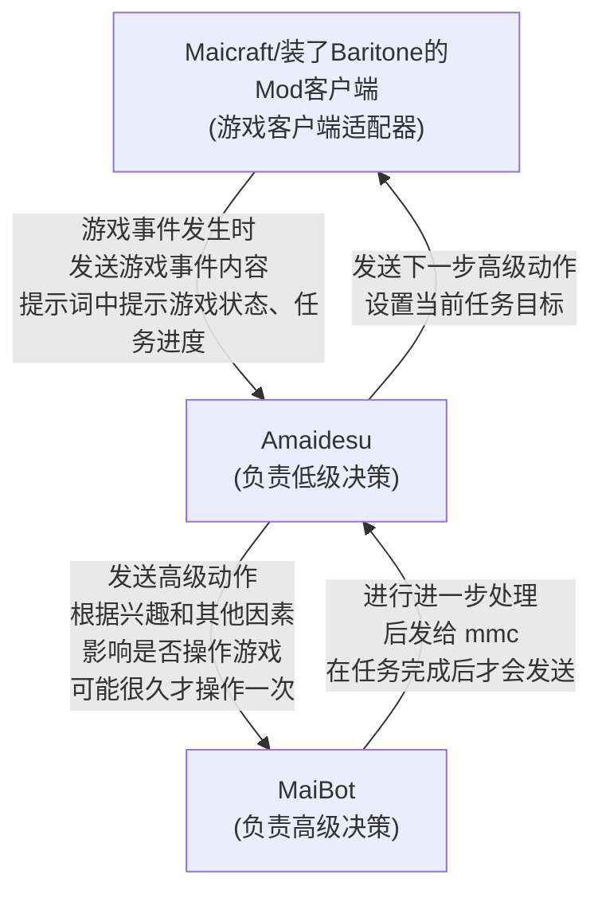
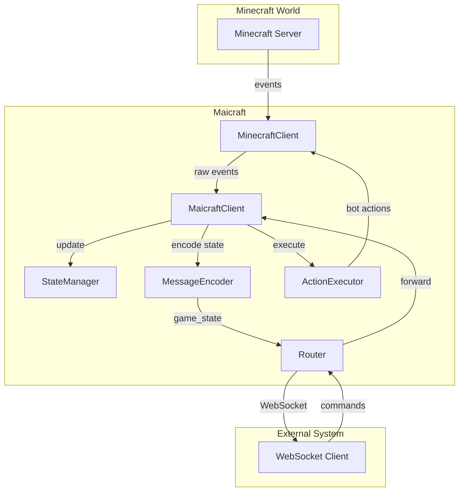

# Maicraft

一个 Minecraft 客户端适配器，旨在作为连接 Minecraft 游戏世界与外部智能决策系统（例如 AI 代理）的桥梁。

Maicraft 基于 [Mineflayer](https://github.com/PrismarineJS/mineflayer) 构建，它能够实时捕获游戏内发生的事件，将完整的游戏状态同步给外部系统，并接收指令以在游戏中执行各种高级动作。

部分高级动作参考[mineland](https://github.com/cocacola-lab/MineLand/)项目的实现。

---

## 什么是"下游系统"？

在本文档中，"下游系统"指的是连接到 Maicraft 的外部应用程序，通常是：
- **AI 决策系统**：如 Amaidesu、MaiBot 等负责分析游戏状态并做出决策的 AI 代理
- **游戏管理工具**：用于监控、控制或分析游戏状态的工具
- **数据分析系统**：收集和分析游戏数据的系统
- **其他自定义应用**：任何需要通过 WebSocket 与 Maicraft 通信的应用程序

下游系统通过 WebSocket 连接到 Maicraft，接收游戏状态更新，并向 Maicraft 发送动作指令。

---

## 决策系统交互流程

外部高、低级决策模块与 Maicraft 之间的交互关系如下所示：



---

## 核心特性

- **事件驱动的状态同步**：不再定时轮询，而是在游戏内发生真实事件（如方块破坏、玩家聊天等）时，立即将最新的游戏状态快照发送给下游系统，确保了信息的及时性和高效性。
- **远程动作执行**：支持外部系统通过 WebSocket 发送指令，执行如移动、合成、挖掘、放置方块等多种预设动作。
- **简洁的消息协议**：采用直接的 JSON 通信协议，提供更高效、更易理解的通信方式。
- **灵活的消息路由**：能够同时连接到多个下游 WebSocket 服务，将游戏状态分发给所有已连接的客户端。
- **高度可扩展的动作系统**：内置一套基础动作，并提供简洁的接口，允许开发者轻松注册自定义的游戏内动作。
- **详细的游戏状态管理**：通过 `StateManager` 维护一个全面的游戏状态视图，包括玩家信息、库存、世界状况和最近的事件历史。

---

## 架构概览

Maicraft 的核心组件之间的交互关系如下所示：



- **`MinecraftClient`**：与 Minecraft 服务器建立底层连接，接收游戏事件并执行机器人动作。
- **`MaicraftClient`**：核心协调器，处理来自游戏和外部系统的所有事件与消息。
- **`StateManager`**：维护机器人当前状态，包括玩家信息、世界信息、库存以及最近事件。
- **`MessageEncoder`**：负责游戏状态和事件的 JSON 编码与解析。
- **`Router`**：管理多个下游 WebSocket 连接，收发并路由所有消息。
- **`ActionExecutor`**：管理并执行全部已注册的游戏动作。

---

## 下游系统对接指南

### 1. 连接建立

下游系统需要连接到 Maicraft 的 WebSocket 端点。连接地址在 Maicraft 配置中指定：

```yaml
router:
  route_config:
    your_service_name:
      url: "ws://localhost:8080/ws"
      token: "your_secret_token"  # 可选
```

#### 连接示例（JavaScript）

```javascript
const WebSocket = require('ws');

const ws = new WebSocket('ws://localhost:8080/ws');

ws.on('open', function open() {
  console.log('已连接到 Maicraft');
});

ws.on('message', function message(data) {
  const payload = JSON.parse(data);
  handleMaicraftMessage(payload);
});

ws.on('close', function close() {
  console.log('连接已关闭');
});
```

### 2. 消息协议

Maicraft 使用纯 JSON 格式进行通信，所有消息都包含一个 `type` 字段来标识消息类型。

#### 2.1 接收来自 Maicraft 的消息

##### Game State 消息
当游戏事件发生时，Maicraft 会推送完整的游戏状态：

```json
{
  "type": "game_state",
  "player": {
    "uuid": "xxxxxxxx-xxxx-xxxx-xxxx-xxxxxxxxxxxx",
    "username": "MaicraftBot",
    "displayName": "MaicraftBot",
    "ping": 42,
    "gamemode": 0
  },
  "position": { "x": 100, "y": 65, "z": -50 },
  "health": 20,
  "food": 20,
  "experience": 0,
  "level": 0,
  "inventory": [
    { "type": "dirt", "count": 64 },
    { "type": "stone", "count": 32 }
  ],
  "weather": "clear",
  "timeOfDay": 6000,
  "dimension": "overworld",
  "nearbyPlayers": [],
  "nearbyEntities": [],
  "recentEvents": [
    {
      "type": "chat",
      "message": "Hello world!",
      "player": "Player1",
      "timestamp": 1640995200000
    }
  ]
}
```

##### Game Event 消息
当配置了 `includeEventDetails=true` 时，会推送单个事件详情：

```json
{
  "type": "game_event",
  "event": {
    "type": "blockBroken",
    "position": { "x": 100, "y": 64, "z": -50 },
    "block": { "type": "stone" },
    "player": "MaicraftBot",
    "timestamp": 1640995200000
  }
}
```

##### Action Result 消息
执行动作后的结果反馈：

```json
{
  "type": "action_result",
  "result": {
    "success": true,
    "message": "动作执行成功"
  },
  "referenceId": "msg_123"
}
```

##### Error 消息
Maicraft 侧发生错误时：

```json
{
  "type": "error",
  "error": "无法连接到 Minecraft 服务器",
  "code": "CONNECTION_FAILED"
}
```

#### 2.2 发送给 Maicraft 的消息

##### 执行动作
发送动作指令给 Maicraft：

```json
{
  "type": "action",
  "action": "chat",
  "params": {
    "message": "Hello world!"
  },
  "message_id": "msg_123"
}
```

##### 查询状态
请求一次完整的游戏状态快照：

```json
{
  "type": "query",
  "message_id": "query_456"
}
```

### 3. 可用动作列表

#### 基础动作

| 动作名称 | 描述 | 参数 |
|---------|------|------|
| `chat` | 发送聊天消息 | `{ "message": "string" }` |
| `moveToPosition` | 移动到指定位置 | `{ "x": number, "y": number, "z": number }` |
| `mineBlock` | 挖掘指定位置的方块 | `{ "x": number, "y": number, "z": number }` |
| `placeBlock` | 在指定位置放置方块 | `{ "x": number, "y": number, "z": number, "blockType": "string" }` |
| `craftItem` | 合成物品 | `{ "itemName": "string", "count": number }` |
| `smeltItem` | 熔炼物品 | `{ "itemName": "string", "count": number }` |
| `useChest` | 使用箱子 | `{ "x": number, "y": number, "z": number }` |
| `followPlayer` | 跟随玩家 | `{ "playerName": "string" }` |
| `killMob` | 攻击附近的生物 | `{ "mobType": "string" }` |
| `swimToLand` | 游到陆地 | `{}` |

#### 动作执行示例

```javascript
// 发送聊天消息
ws.send(JSON.stringify({
  type: "action",
  action: "chat",
  params: { message: "Hello, world!" },
  message_id: "msg_001"
}));

// 移动到指定位置
ws.send(JSON.stringify({
  type: "action",
  action: "moveToPosition",
  params: { x: 100, y: 65, z: -50 },
  message_id: "msg_002"
}));

// 挖掘方块
ws.send(JSON.stringify({
  type: "action",
  action: "mineBlock",
  params: { x: 100, y: 64, z: -50 },
  message_id: "msg_003"
}));
```

### 4. 错误处理

#### 连接错误
- 网络断开时，下游系统应实现自动重连机制
- 建议使用指数退避策略进行重连

#### 消息错误
- 检查接收到的 JSON 格式是否正确
- 验证 `type` 字段是否为预期值
- 处理 `action_result` 中的 `success: false` 情况

#### 示例错误处理

```javascript
ws.on('message', function message(data) {
  try {
    const payload = JSON.parse(data);
    
    if (payload.type === 'error') {
      console.error('Maicraft 错误:', payload.error);
      return;
    }
    
    if (payload.type === 'action_result') {
      if (!payload.result.success) {
        console.error('动作执行失败:', payload.result.message);
      }
      return;
    }
    
    // 处理其他消息类型...
    handleMaicraftMessage(payload);
    
  } catch (error) {
    console.error('消息解析错误:', error);
  }
});
```

### 5. 最佳实践

#### 消息处理
- 使用 `message_id` 来跟踪请求和响应的对应关系
- 实现超时机制，避免无限等待响应
- 对重要动作实现重试机制

#### 状态管理
- 缓存最新的游戏状态，避免重复处理
- 实现状态变更检测，只在状态真正改变时处理
- 定期发送 `query` 消息来同步状态

#### 性能优化
- 避免过于频繁的动作请求
- 批量处理多个动作请求
- 实现消息队列，避免消息丢失

---

## 安装与配置

### 1. 安装依赖

本项目使用 `pnpm` 作为包管理器。

```bash
git clone https://github.com/your-repo/maicraft.git
cd maicraft
pnpm install
```

### 2. 创建配置文件

从模板文件 `config-template.yaml` 复制一份配置，并命名为 `config.yaml`。

```bash
cp config-template.yaml config.yaml
```

然后，根据你的需求修改 `config.yaml`：

```yaml
# Minecraft 服务器配置
minecraft:
  host: "localhost" # 服务器地址
  port: 25565 # 服务器端口
  username: "MaicraftBot" # 机器人用户名
  auth: "offline" # 认证方式 ('offline', 'microsoft', 'mojang')
  # version: "1.20.1"      # 可选，指定游戏版本

# 路由配置
router:
  route_config:
    # Key 是下游服务的唯一标识
    amaidesu:
      url: "ws://localhost:8080/ws" # 下游 WebSocket 服务地址
      token: "your_secret_token" # 可选，用于认证的 Token
      reconnect_interval: 5000 # 可选，重连间隔（毫秒）
      max_reconnect_attempts: 10 # 可选，最大重连次数

# 可选，要监听和转发的游戏事件类型
# 如果不设置，所有事件都会被转发
enabledEvents:
  - "chat"
  - "playerJoined"
  - "blockBroken"

# 状态管理器中保留的最大事件历史数量
maxMessageHistory: 100
```

### 3. 运行

```bash
# 开发模式（使用 ts-node，文件变更时自动重启）
pnpm run dev

# 生产模式（先构建，然后运行 JavaScript 文件）
pnpm run build
pnpm start
```

---

## API 与扩展

### 查询可用动作

你可以通过 `MaicraftClient` 实例获取所有已注册的动作及其信息。

```ts
const client = new MaicraftClient(config);
const actionNames = client.getAvailableActions();
// -> ['moveToPosition', 'chat', 'craftItem', ...]

const actionsInfo = client.getActionsInfo();
/* ->
{
  "chat": {
    "description": "发送聊天消息",
    "params": { "message": "string" }
  },
  ...
}
*/
```

### 注册自定义动作

实现 `ActionInterface` 接口，然后使用 `registerAction` 方法即可注册一个新的动作。

```ts
import type {
  ActionInterface,
  ActionResult,
} from "./minecraft/ActionInterface";
import type { Bot } from "mineflayer";

class DanceAction implements ActionInterface {
  readonly name = "dance";
  readonly description = "让机器人跳一段舞。";

  getParamsSchema(): object {
    return { type: "object", properties: {} };
  }

  async execute(bot: Bot, params: any): Promise<ActionResult> {
    bot.setControlState("jump", true);
    await bot.waitForTicks(20);
    bot.setControlState("jump", false);
    return { success: true, message: "跳舞完毕！" };
  }
}

// 在你的代码中
client.registerAction(new DanceAction());
```
