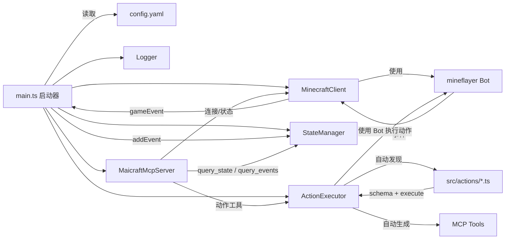
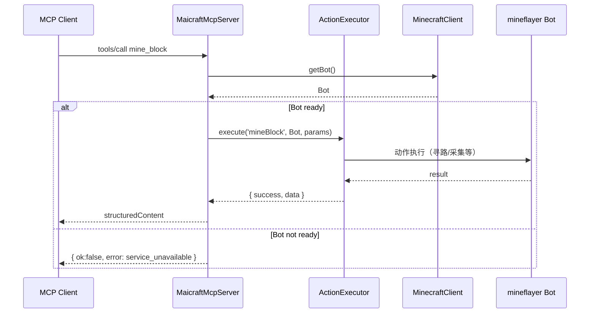
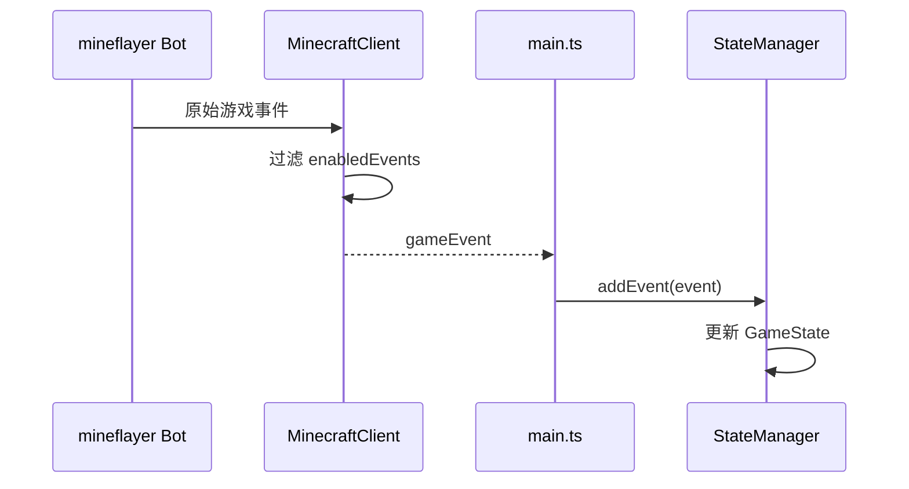

# Maicraft

基于 [mineflayer](https://github.com/PrismarineJS/mineflayer) 构建的 Minecraft MCP Server。

主要用于和[Amaidesu](https://github.com/MaiM-with-u/Amaidesu)项目配合，让[MaiBot](https://github.com/MaiM-with-u/MaiBot)游玩Minecraft游戏。

当然，也可以像普通MCP Server一样使用本项目。

## 功能特性

- 🤖 **Minecraft 机器人**：基于 Mineflayer 的 Minecraft 客户端
- 🔧 **MCP 工具集成**：通过 Model Context Protocol 提供工具接口
- 📊 **状态管理**：实时游戏状态监控和事件记录
- 🎮 **动作执行**：支持挖矿、建造、跟随等基础动作
- 📝 **日志系统**：双重日志输出（stderr + 文件），支持配置化
- ⚡ **动态发现**：动作自动发现与注册，无需手动配置
- 🛡️ **参数校验**：基于 Zod 的自动参数校验与类型安全

## 架构



### 动作系统架构

```mermaid
graph TD
  A[Action File] -->|继承| B[BaseAction]
  A -->|定义| C[schema: z.ZodTypeAny]
  A -->|实现| D[execute: (bot, params) => Promise<ActionResult>]
  
  B -->|自动提供| E[validateParams]
  B -->|自动提供| F[getParamsSchema]
  B -->|自动提供| G[getMcpTools]
  
  G -->|生成| H[MCP Tool: action_name_snake_case]
  C -->|校验| I[参数类型安全]
  C -->|描述| J[自动生成参数文档]
```

### 时序：调用动作（mine_block）



### 时序：事件汇聚与状态更新



## 快速开始

### 1. 安装依赖

```bash
pnpm install
```

### 2. 配置

复制配置文件模板：

```bash
cp config-template.yaml config.yaml
```

编辑 `config.yaml`，配置 Minecraft 服务器连接信息：

```yaml
minecraft:
  host: 127.0.0.1
  port: 25565
  username: MaiBot
  auth: offline

# 日志配置
logging:
  level: INFO
  enableFileLog: true
  useStderr: true
```

### 3. 启动

```bash
# 开发模式（读取 ./config.yaml）
pnpm dev

# 生产模式
pnpm build
pnpm start
```

### 4. 调试 MCP（图形界面）

```bash
pnpm mcp:ui
```

打开浏览器中的 Inspector，验证工具、请求与响应。

### 5. 快速测试（命令行）

```bash
# 列出已注册的工具
pnpm mcp:tools

# 调用 query_state 进行烟囱测试
pnpm mcp:state
```

### 查看日志

程序启动后会在控制台打印日志文件路径。可使用系统命令实时查看：

```powershell
# Windows PowerShell
Get-Content <日志文件路径> -Wait
```

```bash
# macOS/Linux
tail -f <日志文件路径>
```

## 配置说明

### 基础配置

在 `config.yaml` 中配置 Minecraft 服务器连接：

```yaml
minecraft:
  host: 127.0.0.1        # 服务器地址
  port: 25565            # 端口
  username: MaiBot       # 机器人用户名
  auth: offline          # 认证方式：offline | microsoft | mojang
  version: "1.19.0"      # 游戏版本（可选）

enabledEvents:
  - chat                 # 聊天事件
  - playerJoin           # 玩家加入
  - playerLeave          # 玩家离开
  - blockBreak           # 方块破坏
  - blockPlace           # 方块放置

maxMessageHistory: 100   # 事件历史缓存数量
```

### 日志系统配置

Maicraft 使用双重日志系统：
- **stderr 输出**：用于 MCP 通信，避免污染 stdout
- **文件日志**：保存到 `logs/` 目录，方便查看和调试

#### 日志配置选项

在 `config.yaml` 中的 `logging` 部分配置：

```yaml
logging:
  level: INFO             # DEBUG | INFO | WARN | ERROR
  enableFileLog: true     # 是否启用文件日志
  logFilePath: ""         # 日志文件路径，留空使用默认路径
  useStderr: true         # 是否使用 stderr 输出（MCP 模式建议保持 true）
  colors: true            # 是否启用颜色输出
  timestamp: true         # 是否显示时间戳
```

#### 日志文件位置

日志文件默认保存在项目根目录的 `logs/` 文件夹中，文件名格式为：
```
logs/maicraft-YYYY-MM-DDTHH-mm-ss.log
```

#### 查看日志的方法

见上文“查看日志”一节，分别给出了 Windows 与 macOS/Linux 的系统命令。

#### 日志级别

- `DEBUG`：调试信息
- `INFO`：一般信息
- `WARN`：警告信息
- `ERROR`：错误信息

#### 日志格式

```
[2024-01-15 10:30:00] [INFO] [Maicraft] 客户端已启动，按 Ctrl+C 退出。
[2024-01-15 10:30:01] [INFO] [Maicraft] 日志文件位置: /path/to/logs/maicraft-2024-01-15T10-30-00.log
```

#### 日志管理

**日志文件清理**
```bash
# 删除7天前的日志文件
find logs/ -name "*.log" -mtime +7 -delete
```

**Windows 日志清理**
```powershell
# 删除7天前的日志文件
Get-ChildItem logs/*.log | Where-Object {$_.LastWriteTime -lt (Get-Date).AddDays(-7)} | Remove-Item
```

**故障排除**
- 日志文件不生成：检查写入权限和磁盘空间
- 日志文件过大：日志按启动时间分割，可定期清理

### MCP 工具配置

Maicraft 支持多种工具过滤模式，推荐使用黑名单模式：

```yaml
mcp:
  name: "Maicraft MCP"
  version: "0.1.0"
  tools:
    # 方式1：黑名单模式（推荐）- 屏蔽指定工具，其他全部可用
    disabled:
      - use_chest
      - smelt_item
    
    # 方式2：白名单模式 - 仅暴露指定工具
    # enabled:
    #   - mine_block
    #   - place_block
    #   - follow_player
    
    # 方式3：同时使用 - 白名单允许的集合减去黑名单
    # enabled:
    #   - mine_block
    #   - place_block
    #   - chat
    # disabled:
    #   - chat
    
    # 方式4：不配置 - 默认暴露所有工具
    # （删除或注释掉 tools 部分）
```

## 将 Maicraft 配置到第三方 MCP Client（JSON）

以下是通用的 stdio 配置示例，请在你的 MCP Client 配置文件中加入：

```json
{
  "mcpServers": {
    "maicraft": {
      "type": "stdio",
      "command": "node",
      "args": ["/path/to/maicraft/dist/main.js", "/path/to/maicraft/config.yaml"]
    }
  }
}
```

开发阶段也可以改为直接运行 TypeScript 源码：

```json
{
  "mcpServers": {
    "maicraft": {
      "type": "stdio",
      "command": "tsx",
      "args": ["/path/to/maicraft/src/main.ts", "/path/to/maicraft/config.yaml"]
    }
  }
}
```

## 动作开发

### 动作系统特性

- **自动发现**：将动作文件放在 `src/actions/` 目录即可自动发现
- **参数校验**：基于 Zod 的自动参数校验
- **类型安全**：完整的 TypeScript 类型支持
- **MCP 集成**：自动生成对应的 MCP 工具

### 编写新动作

#### 方式1：继承基类（推荐）

```typescript
// src/actions/MyAction.ts
import { BaseAction } from '../minecraft/ActionInterface';
import { z } from 'zod';

interface MyActionParams {
  target: string;
  count?: number;
}

export class MyAction extends BaseAction<MyActionParams> {
  name = 'myAction';
  description = '执行我的自定义动作';
  
  // 定义参数校验 schema
  schema = z.object({
    target: z.string().describe('目标对象'),
    count: z.number().int().min(1).optional().describe('执行次数（可选）'),
  });

  async execute(bot: Bot, params: MyActionParams) {
    try {
      // 实现动作逻辑
      const count = params.count ?? 1;
      
      // ... 具体实现
      
      return this.createSuccessResult(`成功执行动作 ${count} 次`);
    } catch (error) {
      return this.createExceptionResult(error, '执行失败', 'EXECUTION_ERROR');
    }
  }
  
  // validateParams、getParamsSchema、getMcpTools 由基类自动提供
}
```

#### 方式2：函数式定义

```typescript
// src/actions/MyAction.ts
import { defineAction } from '../minecraft/ActionInterface';
import { z } from 'zod';

export const MyAction = defineAction({
  name: 'myAction',
  description: '执行我的自定义动作',
  schema: z.object({
    target: z.string().describe('目标对象'),
    count: z.number().int().min(1).optional().describe('执行次数（可选）'),
  }),
  async execute(bot, params) {
    // 实现动作逻辑
    const count = params.count ?? 1;
    
    // ... 具体实现
    
    return { success: true, message: `成功执行动作 ${count} 次` };
  },
});
```

### 动作自动注册

1. 将动作文件放在 `src/actions/` 目录
2. 文件会被自动发现并注册
3. 对应的 MCP 工具会自动生成（工具名为动作名的 snake_case 形式）
4. 例如：`MyAction` → `my_action` 工具

### 可用的动作工具

当前支持的动作工具：

- `chat` - 发送聊天消息
- `craft_item` - 合成物品
- `smelt_item` - 熔炼物品
- `use_chest` - 使用箱子
- `swim_to_land` - 游向陆地
- `kill_mob` - 击杀生物
- `mine_block` - 挖掘方块
- `place_block` - 放置方块
- `follow_player` - 跟随玩家

## MCP 工具

### 查询工具

- `query_state` - 查询游戏状态
- `query_events` - 查询事件历史

### 动作工具

动作工具会根据 `src/actions/` 目录中的动作文件自动生成，工具名格式为动作名的 snake_case 形式。

## 开发

```bash
# 构建
pnpm build

# 测试
pnpm test

# 代码检查
pnpm lint

# 清理构建文件
pnpm clean
```

## 许可证

MIT
