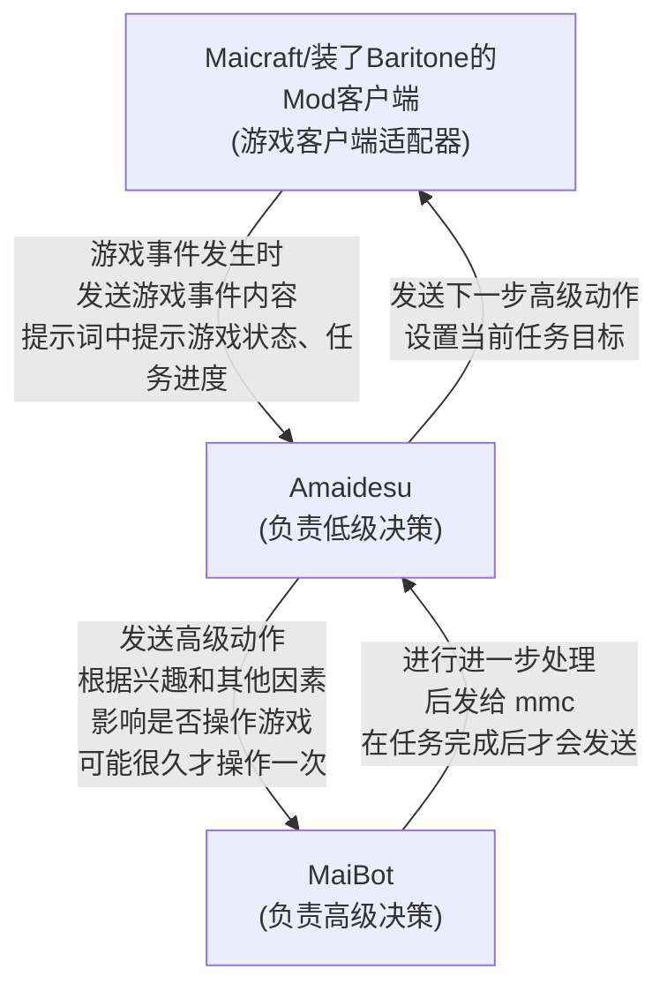
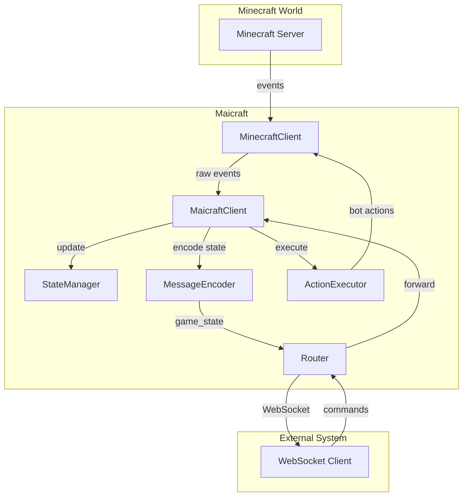

# Maicraft

一个 Minecraft 客户端适配器，旨在作为连接 Minecraft 游戏世界与外部智能决策系统（例如 AI 代理）的桥梁。

Maicraft 基于 [Mineflayer](https://github.com/PrismarineJS/mineflayer) 构建，它能够实时捕获游戏内发生的事件，将完整的游戏状态同步给外部系统，并接收指令以在游戏中执行各种高级动作。

部分高级动作参考[mineland](https://github.com/cocacola-lab/MineLand/)项目的实现。

***

## 决策系统交互流程

外部高、低级决策模块与 Maicraft 之间的交互关系如下所示：



***

## 核心特性

- **事件驱动的状态同步**：不再定时轮询，而是在游戏内发生真实事件（如方块破坏、玩家聊天等）时，立即将最新的游戏状态快照发送给下游系统，确保了信息的及时性和高效性。
- **远程动作执行**：支持外部系统通过 WebSocket 发送指令，执行如移动、合成、挖掘、放置方块等多种预设动作。
- **标准化的消息协议**：所有通信都严格遵循 `maim_message` 协议，将具体业务数据封装在 JSON 格式的文本段中，保证了跨系统通信的规范性和可扩展性。
- **灵活的消息路由**：能够同时连接到多个下游 WebSocket 服务，将游戏状态分发给所有已连接的客户端。
- **高度可扩展的动作系统**：内置一套基础动作，并提供简洁的接口，允许开发者轻松注册自定义的游戏内动作。
- **详细的游戏状态管理**：通过 `StateManager` 维护一个全面的游戏状态视图，包括玩家信息、库存、世界状况和最近的事件历史。

***

## 架构概览

Maicraft 的核心组件之间的交互关系如下所示：



- **`MinecraftClient`**：与 Minecraft 服务器建立底层连接，接收游戏事件并执行机器人动作。
- **`MaicraftClient`**：核心协调器，处理来自游戏和外部系统的所有事件与消息。
- **`StateManager`**：维护机器人当前状态，包括玩家信息、世界信息、库存以及最近事件。
- **`MessageEncoder`**：负责 `maim_message` 协议的编码与解析。
- **`Router`**：管理多个下游 WebSocket 连接，收发并路由所有消息。
- **`ActionExecutor`**：管理并执行全部已注册的游戏动作。

***

## 安装与配置

### 1. 安装依赖

本项目使用 `pnpm` 作为包管理器。

```bash
git clone https://github.com/your-repo/maicraft.git
cd maicraft
pnpm install
```

### 2. 创建配置文件

从模板文件 `config-template.yaml` 复制一份配置，并命名为 `config.yaml`。

```bash
cp config-template.yaml config.yaml
```

然后，根据你的需求修改 `config.yaml`：

```yaml
# Minecraft 服务器配置
minecraft:
  host: "localhost"       # 服务器地址
  port: 25565              # 服务器端口
  username: "MaicraftBot" # 机器人用户名
  auth: "offline"         # 认证方式 ('offline', 'microsoft', 'mojang')
  # version: "1.20.1"      # 可选，指定游戏版本

# 路由配置
router:
  route_config:
    # Key 是下游服务的唯一标识
    amaidesu:
      url: "ws://localhost:8080/ws" # 下游 WebSocket 服务地址
      token: "your_secret_token"    # 可选，用于认证的 Token
      reconnect_interval: 5000      # 可选，重连间隔（毫秒）
      max_reconnect_attempts: 10    # 可选，最大重连次数

# 可选，要监听和转发的游戏事件类型
# 如果不设置，所有事件都会被转发
enabledEvents:
  - "chat"
  - "playerJoined"
  - "blockBroken"

# 状态管理器中保留的最大事件历史数量
maxMessageHistory: 100
```

### 3. 运行

```bash
# 开发模式（使用 ts-node，文件变更时自动重启）
pnpm run dev

# 生产模式（先构建，然后运行 JavaScript 文件）
pnpm run build
pnpm start
```

***

## 消息协议 (`maim_message`)

所有通信均遵循 [maim_message](https://github.com/AigisGuardian/maim_message) 协议。Maicraft 仅在 `message_segment` 的 `text` 字段中放入 *纯文本* JSON 字符串，外层完整的 maim_message 结构由 Router/WebSocketClient 负责转发。

### 载荷联合类型

Maicraft 在内部使用联合类型 `MaicraftPayload`（见 `src/messaging/PayloadTypes.ts`）统一描述所有可能负载：

```ts
export type MaicraftPayload =
  | GameEventPayload         // 游戏事件推送
  | GameStatePayload         // 完整状态快照
  | ChatPayload              // 聊天消息
  | SystemNotificationPayload// 系统通知
  | LowLevelDecisionPayload  // 低级决策 (Amaidesu)
  | HighLevelDecisionPayload // 高级决策 (MaiBot)
  | ErrorPayload             // 错误信息
  | ActionResultPayload      // 动作执行结果
  | StateResponsePayload     // 状态查询响应
  | ActionPayload            // 动作请求 (下游→Maicraft)
  | QueryPayload;            // 状态查询请求 (下游→Maicraft)
```

以下内容按通信方向展开说明。

#### 1. Maicraft → 下游（推送）

| `type` 值            | 发送时机 / 语义                                        |
| -------------------- | ----------------------------------------------------- |
| `game_state`         | 任一游戏事件发生时，推送完整状态快照                  |
| `game_event`         | `includeEventDetails=true` 时，推送单个事件            |
| `chat`               | 游戏内出现聊天内容（机器人或其他玩家）                |
| `system_notification`| 系统级通知（连接/断开、服务器广播等）                 |
| `error`              | Maicraft 侧异常                                       |
| `action_result`      | 执行动作 (`action`) 后的结果                           |
| `query_response`     | 处理 `query` 请求后的返回                              |

**game_state 载荷示例**（位于 `text` 字段中）：

```json
{
  "type": "game_state",
  "player": {
    "uuid": "xxxxxxxx-xxxx-xxxx-xxxx-xxxxxxxxxxxx",
    "username": "MaicraftBot",
    "displayName": "MaicraftBot",
    "ping": 42,
    "gamemode": 0
  },
  "position": { "x": 100, "y": 65, "z": -50 },
  "health": 20,
  "food": 20,
  "experience": 0,
  "level": 0,
  "inventory": [ { "type": "dirt", "count": 64 } ],
  "weather": "clear",
  "timeOfDay": 6000,
  "dimension": "overworld",
  "nearbyPlayers": [],
  "nearbyEntities": [],
  "recentEvents": []
}
```

> `MessageEncoder` 会将 `GameState` 字段**平铺**在最外层（而非放在 `state` 字段内），保持向后兼容。

#### 2. 下游 → Maicraft（请求）

| `type` 值 | 说明                     | 核心字段                |
| ---------- | ---------------------- | ----------------------- |
| `action`   | 执行动作                | `action`, `params?`     |
| `query`    | 请求一次完整状态快照    | *(无)*                  |

**action 请求示例**：

```json
{ "type": "action", "action": "chat", "params": { "message": "Hello world!" } }
```

Maicraft 会异步返回一条 `action_result`：

```json
{ "type": "action_result", "result": { "success": true }, "referenceId": "<same_message_id>" }
```

#### 3. 结构定义索引

- **GameState**：`src/minecraft/StateManager.ts`
- **GameEvent**：`src/minecraft/GameEvent.ts`
- 其它载荷：`src/messaging/PayloadTypes.ts`

---

所有示例仅展示 `message_segment.text` 内部的负载内容。真实传输时，它们会被包装进标准 `maim_message` ：

```jsonc
{
  "message_info": { /* 省略 */ },
  "message_segment": {
    "type": "seglist",
    "data": [
      { "type": "text", "data": "{...负载...}" }
    ]
  },
  "raw_message": "{...负载...}"
}
```

***

## API 与扩展

### 查询可用动作

你可以通过 `MaicraftClient` 实例获取所有已注册的动作及其信息。

```ts
const client = new MaicraftClient(config);
const actionNames = client.getAvailableActions();
// -> ['moveToPosition', 'chat', 'craftItem', ...]

const actionsInfo = client.getActionsInfo();
/* ->
{
  "chat": {
    "description": "发送聊天消息",
    "params": { "message": "string" }
  },
  ...
}
*/
```

### 注册自定义动作

实现 `ActionInterface` 接口，然后使用 `registerAction` 方法即可注册一个新的动作。

```ts
import type { ActionInterface, ActionResult } from './minecraft/ActionInterface';
import type { Bot } from 'mineflayer';

class DanceAction implements ActionInterface {
  readonly name = 'dance';
  readonly description = '让机器人跳一段舞。';
  
  getParamsSchema(): object {
    return { type: 'object', properties: {} };
  }

  async execute(bot: Bot, params: any): Promise<ActionResult> {
    bot.setControlState('jump', true);
    await bot.waitForTicks(20);
    bot.setControlState('jump', false);
    return { success: true, message: '跳舞完毕！' };
  }
}

// 在你的代码中
client.registerAction(new DanceAction());
```