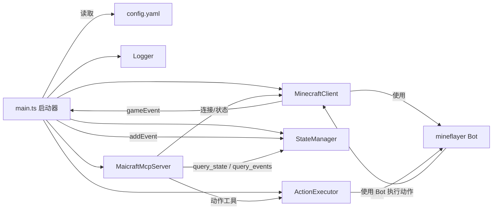
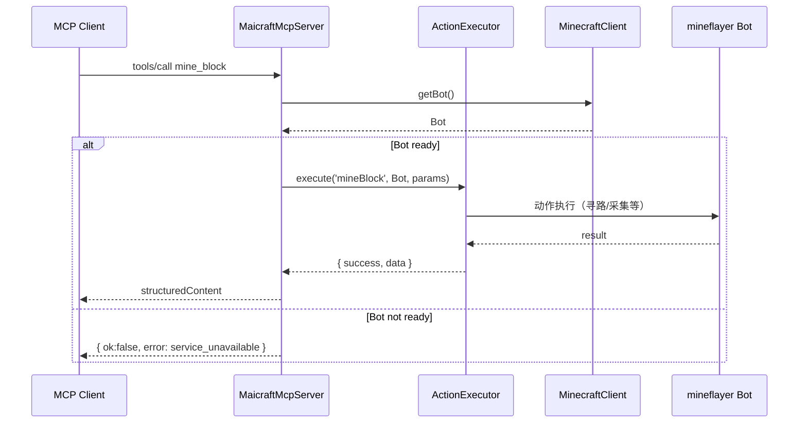
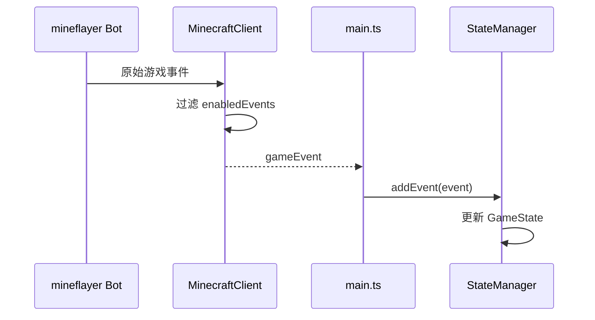

# Maicraft

Minecraft × MCP 机器人服务：通过 MCP 工具查询状态/事件并执行基础动作

## 功能特性

- 🤖 **Minecraft 机器人**：基于 Mineflayer 的 Minecraft 客户端
- 🔧 **MCP 工具集成**：通过 Model Context Protocol 提供工具接口
- 📊 **状态管理**：实时游戏状态监控和事件记录
- 🎮 **动作执行**：支持挖矿、建造、跟随等基础动作
- 📝 **日志系统**：双重日志输出（stderr + 文件），支持配置化

## 架构



### 时序：调用动作（mine_block）



### 时序：事件汇聚与状态更新



## 快速开始

### 1. 安装依赖

```bash
pnpm install
```

### 2. 配置

复制配置文件模板：

```bash
cp config-template.yaml config.yaml
```

编辑 `config.yaml`，配置 Minecraft 服务器连接信息：

```yaml
minecraft:
  host: 127.0.0.1
  port: 25565
  username: MaiBot
  auth: offline

# 日志配置
logging:
  level: INFO
  enableFileLog: true
  useStderr: true
```

### 3. 启动

```bash
# 开发模式
pnpm run dev

# 生产模式
pnpm run build
pnpm start
```

### 4. 查看日志

```bash
# 实时查看日志
pnpm run log

# 测试日志配置
pnpm run test:logging
```

## 配置说明

### 基础配置

在 `config.yaml` 中配置 Minecraft 服务器连接：

```yaml
minecraft:
  host: 127.0.0.1        # 服务器地址
  port: 25565            # 端口
  username: MaiBot       # 机器人用户名
  auth: offline          # 认证方式：offline | microsoft | mojang
  version: "1.19.0"      # 游戏版本（可选）

enabledEvents:
  - chat                 # 聊天事件
  - playerJoin           # 玩家加入
  - playerLeave          # 玩家离开
  - blockBreak           # 方块破坏
  - blockPlace           # 方块放置

maxMessageHistory: 100   # 事件历史缓存数量
```

### 日志系统配置

Maicraft 使用双重日志系统：
- **stderr 输出**：用于 MCP 通信，避免污染 stdout
- **文件日志**：保存到 `logs/` 目录，方便查看和调试

#### 日志配置选项

在 `config.yaml` 中的 `logging` 部分配置：

```yaml
logging:
  level: INFO             # DEBUG | INFO | WARN | ERROR
  enableFileLog: true     # 是否启用文件日志
  logFilePath: ""         # 日志文件路径，留空使用默认路径
  useStderr: true         # 是否使用 stderr 输出（MCP 模式建议保持 true）
  colors: true            # 是否启用颜色输出
  timestamp: true         # 是否显示时间戳
```

#### 日志文件位置

日志文件默认保存在项目根目录的 `logs/` 文件夹中，文件名格式为：
```
logs/maicraft-YYYY-MM-DDTHH-mm-ss.log
```

#### 查看日志的方法

**1. 实时查看日志（推荐）**
```bash
# 查看最新的日志文件
pnpm run log

# 或者指定特定日志文件
node scripts/watch-log.js logs/maicraft-2024-01-15T10-30-00.log
```

**2. 直接查看日志文件**
```bash
# 查看完整日志
cat logs/maicraft-2024-01-15T10-30-00.log

# 查看最后100行
tail -n 100 logs/maicraft-2024-01-15T10-30-00.log

# 实时跟踪日志（类似 tail -f）
tail -f logs/maicraft-2024-01-15T10-30-00.log
```

**3. 在 Windows 上查看**
```powershell
# 查看完整日志
Get-Content logs/maicraft-2024-01-15T10-30-00.log

# 查看最后100行
Get-Content logs/maicraft-2024-01-15T10-30-00.log -Tail 100

# 实时跟踪日志
Get-Content logs/maicraft-2024-01-15T10-30-00.log -Wait
```

#### 日志级别

- `DEBUG`：调试信息
- `INFO`：一般信息
- `WARN`：警告信息
- `ERROR`：错误信息

#### 日志格式

```
[2024-01-15 10:30:00] [INFO] [Maicraft] 客户端已启动，按 Ctrl+C 退出。
[2024-01-15 10:30:01] [INFO] [Maicraft] 日志文件位置: /path/to/logs/maicraft-2024-01-15T10-30-00.log
```

#### 日志管理

**日志文件清理**
```bash
# 删除7天前的日志文件
find logs/ -name "*.log" -mtime +7 -delete
```

**Windows 日志清理**
```powershell
# 删除7天前的日志文件
Get-ChildItem logs/*.log | Where-Object {$_.LastWriteTime -lt (Get-Date).AddDays(-7)} | Remove-Item
```

**故障排除**
- 日志文件不生成：检查写入权限和磁盘空间
- 日志文件过大：日志按启动时间分割，可定期清理

### MCP 配置

```yaml
mcp:
  name: "Maicraft MCP"
  version: "0.1.0"
  tools:
    enabled:               # 可选：仅暴露指定工具，留空则全部可用
      - mine_block
      - place_block
      - follow_player
```

## MCP 工具

### 查询工具

- `ping` - 测试连接
- `query_state` - 查询游戏状态
- `query_events` - 查询事件历史

### 动作工具

- `mine_block` - 挖掘方块
- `place_block` - 放置方块
- `follow_player` - 跟随玩家

## 开发

```bash
# 构建
pnpm run build

# 测试
pnpm run test

# 代码检查
pnpm run lint

# 清理构建文件
pnpm run clean
```

## 许可证

MIT
