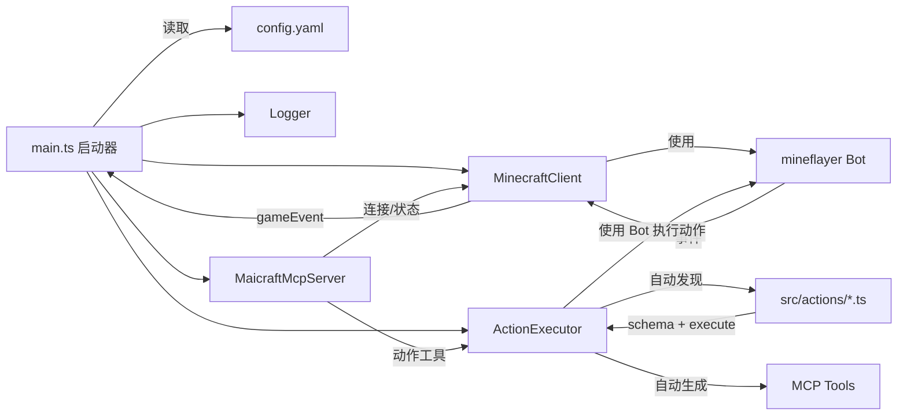
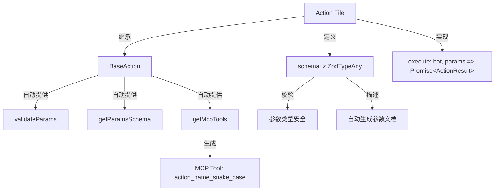
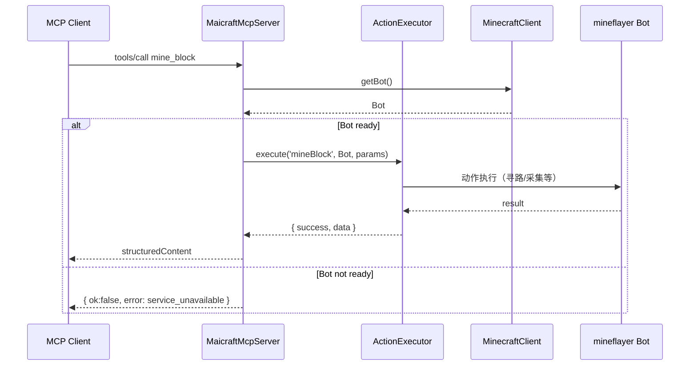
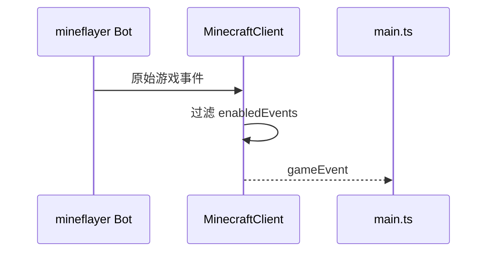

# Maicraft

基于 [mineflayer](https://github.com/PrismarineJS/mineflayer) 构建的 Minecraft MCP Server。

主要用于和[Amaidesu](https://github.com/MaiM-with-u/Amaidesu)项目配合，让[MaiBot](https://github.com/MaiM-with-u/MaiBot)游玩Minecraft游戏。

当然，也可以像普通MCP Server一样使用本项目。

部分高级动作的实现参考自 [mineland](https://github.com/cocacola-lab/MineLand)

## 快速配置

```json
{
  "mcpServers": {
    "maicraft": {
      "transport": "stdio",
      "command": "npx",
      "args": [
        "-y",
        "maicraft",
        "--host","127.0.0.1",
        "--port","25565",
        "--username","Mai",
         "--auth", "offline"
      ]
    }
  }
}

```


## 功能特性

- 🤖 **Minecraft 机器人**：基于 Mineflayer 的 Minecraft 客户端
- 🔧 **MCP 工具集成**：通过 Model Context Protocol 提供工具接口
- 📊 **状态管理**：实时游戏状态监控和事件记录
- 🎮 **动作执行**：支持挖矿、建造、跟随等基础动作
- 📝 **日志系统**：双重日志输出（stderr + 文件），支持配置化
- ⚡ **动态发现**：动作自动发现与注册，无需手动配置
- 🛡️ **参数校验**：基于 Zod 的自动参数校验与类型安全

## 架构



### 动作系统架构



### 时序：调用动作（mine_block）



### 时序：事件处理



## 快速开始

### 方式一：使用 npx（推荐｜无需全局安装）

```bash
# 直接运行（首次会自动拉取包）
npx -y maicraft --init-config
```

### 方式二：从源码安装

```bash
# 克隆仓库
git clone https://github.com/ChangingSelf/Maicraft.git
cd Maicraft

# 安装依赖
pnpm install
```

### 2. 配置

#### 方式一：npx 用户

```bash
# 复制配置文件模板到当前目录
npx -y maicraft --init-config
```

#### 方式二：源码安装用户

```bash
# 复制配置文件模板
cp config-template.yaml config.yaml
```

编辑 `config.yaml`，配置 Minecraft 服务器连接信息：

```yaml
minecraft:
  host: 127.0.0.1
  port: 25565
  username: MaiBot
  auth: offline

# 日志配置
logging:
  level: INFO
  enableFileLog: true
  useStderr: true
```

### 3. 启动

#### 方式一：npx 用户

```bash
# 直接启动（读取当前目录的 config.yaml）
npx -y maicraft

# 指定配置文件路径
npx -y maicraft /path/to/config.yaml

# 或使用命令行参数覆盖部分配置（无需编辑文件）
npx -y maicraft --host 127.0.0.1 --port 25565 --username MaiBot --auth offline --log-level INFO
```

#### 方式二：源码安装用户

```bash
# 开发模式（读取 ./config.yaml）
pnpm dev

# 生产模式
pnpm build
pnpm start
```

### 4. 调试 MCP（图形界面）

#### 方式一：npx 用户

```bash
# 需要先安装mcp-inspector
npm install -g @modelcontextprotocol/inspector

# 创建mcp-inspector.json配置文件
cat > mcp-inspector.json << EOF
{
  "mcpServers": {
    "maicraft": {
      "type": "stdio",
      "command": "npx",
      "args": ["-y", "maicraft", "./config.yaml"]
    }
  }
}
EOF

# 启动调试界面
mcp-inspector --config mcp-inspector.json --server maicraft
```

#### 方式二：源码安装用户

```bash
pnpm mcp:ui
```

打开浏览器中的 Inspector，验证工具、请求与响应。

### 5. 快速测试（命令行）

#### 方式一：npx 用户

```bash
# 需要先安装mcp-inspector
npm install -g @modelcontextprotocol/inspector

# 列出已注册的工具
mcp-inspector --cli --config mcp-inspector.json --server maicraft --method tools/list

# 调用 query_state 进行烟囱测试
mcp-inspector --cli --config mcp-inspector.json --server maicraft --method tools/call --tool-name query_state
```

#### 方式二：源码安装用户

```bash
# 列出已注册的工具
pnpm mcp:tools

# 调用 query_state 进行烟囱测试
pnpm mcp:state
```

### 查看日志

程序启动后会在控制台打印日志文件路径。可使用系统命令实时查看：

```powershell
# Windows PowerShell
Get-Content <日志文件路径> -Wait
```

```bash
# macOS/Linux
tail -f <日志文件路径>
```

## 配置说明

### 基础配置

在 `config.yaml` 中配置 Minecraft 服务器连接：

```yaml
minecraft:
  host: 127.0.0.1        # 服务器地址
  port: 25565            # 端口
  username: MaiBot       # 机器人用户名
  auth: offline          # 认证方式：offline | microsoft | mojang
  version: "1.19.0"      # 游戏版本（可选）

enabledEvents:
  - chat                 # 聊天事件
  - playerJoin           # 玩家加入
  - playerLeave          # 玩家离开
  - blockBreak           # 方块破坏
  - blockPlace           # 方块放置

# 不能破坏的方块列表配置
# 机器人路径查找时会避免破坏这些方块
blocksCantBreak:
  - chest        # 箱子
  - furnace      # 熔炉
  - bed          # 床
  - door         # 门
  - trapdoor     # 活板门
  - sign         # 告示牌
  - torch        # 火把
  - lantern      # 灯笼

maxMessageHistory: 100   # 事件历史缓存数量
```

### 路径查找配置

#### 不能破坏的方块列表

`blocksCantBreak` 配置项用于指定机器人在路径查找时不能破坏的方块列表。当机器人需要移动到某个位置时，它会避免破坏这些重要的方块。

```yaml
# 不能破坏的方块列表配置
blocksCantBreak:
  - chest        # 箱子
  - furnace      # 熔炉
  - bed          # 床
  - door         # 门
  - trapdoor     # 活板门
  - sign         # 告示牌
  - torch        # 火把
  - lantern      # 灯笼
```

**配置说明：**
- 如果不配置此选项，将使用默认列表：`['chest', 'furnace']`
- 可以设置为空数组 `[]` 来允许破坏所有方块
- 方块名称使用 Minecraft 的英文名称（如 `chest`、`furnace` 等）
- 如果配置了未知的方块名称，会在日志中显示警告信息

**常见方块名称参考：**
- `chest` - 箱子
- `furnace` - 熔炉
- `crafting_table` - 工作台
- `bed` - 床
- `door` - 门
- `trapdoor` - 活板门
- `sign` - 告示牌
- `torch` - 火把
- `lantern` - 灯笼
- `anvil` - 铁砧
- `enchanting_table` - 附魔台
- `brewing_stand` - 酿造台

### 日志系统配置

Maicraft 使用双重日志系统：
- **stderr 输出**：用于 MCP 通信，避免污染 stdout
- **文件日志**：保存到 `logs/` 目录，方便查看和调试

#### 日志配置选项

在 `config.yaml` 中的 `logging` 部分配置：

```yaml
logging:
  level: INFO             # DEBUG | INFO | WARN | ERROR
  enableFileLog: true     # 是否启用文件日志
  logFilePath: ""         # 日志文件路径，留空使用默认路径
  useStderr: true         # 是否使用 stderr 输出（MCP 模式建议保持 true）
  colors: true            # 是否启用颜色输出
  timestamp: true         # 是否显示时间戳
```

#### 日志文件位置

日志文件默认保存在项目根目录的 `logs/` 文件夹中，文件名格式为：
```
logs/maicraft-YYYY-MM-DDTHH-mm-ss.log
```

#### 查看日志的方法

见上文“查看日志”一节，分别给出了 Windows 与 macOS/Linux 的系统命令。

#### 日志级别

- `DEBUG`：调试信息
- `INFO`：一般信息
- `WARN`：警告信息
- `ERROR`：错误信息

#### 日志格式

```
[2024-01-15 10:30:00] [INFO] [Maicraft] 客户端已启动，按 Ctrl+C 退出。
[2024-01-15 10:30:01] [INFO] [Maicraft] 日志文件位置: /path/to/logs/maicraft-2024-01-15T10-30-00.log
```

#### 日志管理

**日志文件清理**
```bash
# 删除7天前的日志文件
find logs/ -name "*.log" -mtime +7 -delete
```

**Windows 日志清理**
```powershell
# 删除7天前的日志文件
Get-ChildItem logs/*.log | Where-Object {$_.LastWriteTime -lt (Get-Date).AddDays(-7)} | Remove-Item
```

**故障排除**
- 日志文件不生成：检查写入权限和磁盘空间
- 日志文件过大：日志按启动时间分割，可定期清理

### MCP 工具配置

Maicraft 支持多种工具过滤模式，推荐使用黑名单模式：

```yaml
mcp:
  name: "Maicraft MCP"
  version: "1.0.0"
  tools:
    # 方式1：黑名单模式（推荐）- 屏蔽指定工具，其他全部可用
    disabled:
      - use_chest
      - smelt_item
    
    # 方式2：白名单模式 - 仅暴露指定工具
    # enabled:
    #   - mine_block
    #   - place_block
    #   - follow_player
    
    # 方式3：同时使用 - 白名单允许的集合减去黑名单
    # enabled:
    #   - mine_block
    #   - place_block
    #   - chat
    # disabled:
    #   - chat
    
    # 方式4：不配置 - 默认暴露所有工具
    # （删除或注释掉 tools 部分）
```

## 将 Maicraft 配置到第三方 MCP Client（JSON）

### 方式一：npx 用户

```json
{
  "mcpServers": {
    "maicraft": {
      "type": "stdio",
      "command": "npx",
      "args": ["-y", "maicraft", "./config.yaml"]
    }
  }
}
```

或者使用命令行参数覆盖配置

```json
{
  "mcpServers": {
    "maicraft": {
      "type": "stdio",
      "command": "npx",
      "args": ["-y", "maicraft", "--host 127.0.0.1", "--port", "25565", "--username", "MaiBot", "--auth", "offline"]
    }
  }
}
```

### 方式二：源码安装用户

```json
{
  "mcpServers": {
    "maicraft": {
      "type": "stdio",
      "command": "node",
      "args": ["/path/to/maicraft/dist/main.js", "/path/to/maicraft/config.yaml"]
    }
  }
}
```

开发阶段也可以改为直接运行 TypeScript 源码：

```json
{
  "mcpServers": {
    "maicraft": {
      "type": "stdio",
      "command": "tsx",
      "args": ["/path/to/maicraft/src/main.ts", "/path/to/maicraft/config.yaml"]
    }
  }
}
```

## 动作开发

### 动作系统特性

- **自动发现**：将动作文件放在 `src/actions/` 目录即可自动发现
- **参数校验**：基于 Zod 的自动参数校验
- **类型安全**：完整的 TypeScript 类型支持
- **MCP 集成**：自动生成对应的 MCP 工具

### 编写新动作

#### 方式1：继承基类（推荐）

```typescript
// src/actions/MyAction.ts
import { BaseAction } from '../minecraft/ActionInterface';
import { z } from 'zod';

interface MyActionParams {
  target: string;
  count?: number;
}

export class MyAction extends BaseAction<MyActionParams> {
  name = 'myAction';
  description = '执行我的自定义动作';
  
  // 定义参数校验 schema
  schema = z.object({
    target: z.string().describe('目标对象'),
    count: z.number().int().min(1).optional().describe('执行次数（可选）'),
  });

  async execute(bot: Bot, params: MyActionParams) {
    try {
      // 实现动作逻辑
      const count = params.count ?? 1;
      
      // ... 具体实现
      
      return this.createSuccessResult(`成功执行动作 ${count} 次`);
    } catch (error) {
      return this.createExceptionResult(error, '执行失败', 'EXECUTION_ERROR');
    }
  }
  
  // validateParams、getParamsSchema、getMcpTools 由基类自动提供
}
```

#### 方式2：函数式定义

```typescript
// src/actions/MyAction.ts
import { defineAction } from '../minecraft/ActionInterface';
import { z } from 'zod';

export const MyAction = defineAction({
  name: 'myAction',
  description: '执行我的自定义动作',
  schema: z.object({
    target: z.string().describe('目标对象'),
    count: z.number().int().min(1).optional().describe('执行次数（可选）'),
  }),
  async execute(bot, params) {
    // 实现动作逻辑
    const count = params.count ?? 1;
    
    // ... 具体实现
    
    return { success: true, message: `成功执行动作 ${count} 次` };
  },
});
```

### 动作自动注册

1. 将动作文件放在 `src/actions/` 目录
2. 文件会被自动发现并注册
3. 对应的 MCP 工具会自动生成（工具名为动作名的 snake_case 形式）
4. 例如：`MyAction` → `my_action` 工具

### 动作开发最佳实践

#### 1. 参数设计原则
- 使用清晰的参数名称，避免缩写
- 为可选参数提供合理的默认值
- 使用 Zod schema 进行严格的参数校验
- 在参数描述中提供示例和说明

#### 2. 错误处理
- 使用 `createErrorResult()` 返回业务逻辑错误
- 使用 `createExceptionResult()` 返回异常错误
- 提供有意义的错误代码和消息
- 记录详细的调试日志

#### 3. 返回值设计
- 使用 `createSuccessResult()` 返回成功结果
- 在返回数据中包含有用的状态信息
- 保持返回格式的一致性

#### 4. 依赖检查
- 检查必要的插件是否已加载（如 pathfinder）
- 验证目标对象是否存在（如方块、玩家、实体）
- 确保背包中有必要的物品

#### 5. 性能考虑
- 设置合理的超时时间
- 限制搜索范围（如 maxDistance）
- 避免无限循环和长时间阻塞

### 可用的动作工具

当前支持的动作工具：

#### 基础交互动作
- **`chat`** - 发送聊天消息
  - 参数：`message` (字符串) - 要发送的聊天消息

- **`basic_control`** - 基础游戏控制功能
  - 参数：
    - `type` (字符串) - 控制类型：`toss` | `move` | `jump` | `sneak` | `look_at` | `sleep` | `wake` | `stop_move` | `stop_sneak`
    - `item` (字符串，可选) - 物品名称或ID (用于 toss 类型)
    - `count` (数字，可选) - 物品数量 (用于 toss 类型，默认 1)
    - `direction` (字符串，可选) - 移动方向 (用于 move 类型：`forward` | `back` | `left` | `right`)

    - `lookType` (字符串，可选) - 注视类型 (用于 look_at 类型：`angle` | `position` | `player` | `entity` | `block`)
    - `yaw` (数字，可选) - 视角偏航角，弧度 (用于 angle 注视类型)
    - `pitch` (数字，可选) - 视角俯仰角，弧度 (用于 angle 注视类型)
    - `x`, `y`, `z` (数字，可选) - 目标坐标 (用于 position 注视类型)
    - `force` (布尔值，可选) - 是否强制看向 (用于所有注视类型，默认 false)
    - `player` (字符串，可选) - 目标玩家名称 (用于 player 注视类型)
    - `entity` (字符串，可选) - 目标实体类型 (用于 entity 注视类型)，例如 cow, pig, zombie 等
    - `block` (字符串，可选) - 目标方块名称 (用于 block 注视类型)，例如 dirt, stone, diamond_ore 等
    - `maxDistance` (数字，可选) - 搜索距离 (用于 entity 和 block 注视类型，默认 64)

- **`use_item`** - 使用手中物品
  - 参数：
    - `itemName` (字符串，可选) - 物品名称，不指定则使用当前手持物品
    - `useType` (字符串，可选) - 使用类型：`consume` | `activate` | `useOn`
    - `targetEntityName` (字符串，可选) - 目标实体名称，仅在使用 `useOn` 类型时需要
    - `targetPlayerName` (字符串，可选) - 目标玩家名称，仅在使用 `useOn` 类型时需要
    - `offHand` (布尔值，可选) - 是否使用副手，默认 false

#### 移动与导航动作
- **`move`** - 移动到指定位置
  - 参数：
    - `type` (字符串) - 移动类型：`coordinate` | `block` | `player` | `entity`
    - `useAbsoluteCoords` (布尔值，可选) - 是否使用绝对坐标，默认 false
    - `x`, `y`, `z` (数字，可选) - 目标坐标 (当 type 为 coordinate 时必需)
    - `block` (字符串，可选) - 目标方块名称 (当 type 为 block 时必需)
    - `player` (字符串，可选) - 目标玩家名称 (当 type 为 player 时必需)
    - `entity` (字符串，可选) - 目标实体类型 (当 type 为 entity 时必需)
    - `distance` (数字，可选) - 到达距离，默认 1
    - `timeout` (数字，可选) - 超时时间(秒)，默认 60
    - `maxDistance` (数字，可选) - 最大移动距离，默认 100

- **`follow_player`** - 跟随指定玩家
  - 参数：
    - `player` (字符串) - 目标玩家名称
    - `distance` (数字，可选) - 跟随距离(格)，默认 3
    - `timeout` (数字，可选) - 超时时间(秒)，默认 5

- **`swim_to_land`** - 游向最近的陆地
  - 参数：
    - `maxDistance` (数字，可选) - 最大搜索距离，默认 64
    - `timeout` (数字，可选) - 超时时间(秒)，默认 60

#### 方块操作动作
- **`mine_block`** - 挖掘指定类型的方块
  - 参数：
    - `name` (字符串) - 方块名称，例如 "dirt", "stone", "coal_ore"
    - `count` (数字，可选) - 需要挖掘的数量，默认 1
    - `direction` (字符串，可选) - 挖掘方向：`+y` | `-y` | `+z` | `-z` | `+x` | `-x`（坐标轴方向），不指定时在附近搜索
    - `maxDistance` (数字，可选) - 搜索距离，默认 48
    - `bypassAllCheck` (布尔值，可选) - 是否绕过所有检查直接挖掘，默认 false

- **`place_block`** - 在指定位置放置方块
  - 参数：
    - `x`, `y`, `z` (数字) - 目标位置坐标
    - `block` (字符串) - 要放置的方块名称
    - `face` (字符串，可选) - 放置面向：`+y` | `-y` | `+z` | `-z` | `+x` | `-x`（坐标轴方向）
    - `useAbsoluteCoords` (布尔值，可选) - 是否使用绝对坐标，默认 false

#### 物品制作动作
- **`craft_item`** - 合成指定物品
  - 参数：
    - `item` (字符串) - 要合成的物品名称
    - `count` (数字，可选) - 合成数量，默认 1

- **`start_smelting`** - 在熔炉中开始熔炼物品（不等待完成）
  - 参数：
    - `item` (字符串) - 要熔炼的物品名称
    - `fuel` (字符串) - 燃料物品名称
    - `count` (数字，可选) - 熔炼数量，默认 1

- **`collect_smelted_items`** - 从熔炉中收集已熔炼完成的物品
  - 参数：
    - `item` (字符串，可选) - 要收集的熔炼产物名称，不指定则收集所有产物
    - `x`, `y`, `z` (数字，可选) - 熔炉坐标
    - `useAbsoluteCoords` (布尔值，可选) - 是否使用绝对坐标，默认 false

- **`smelt_item`** - 在熔炉中熔炼物品（已弃用，建议使用 start_smelting + collect_smelted_items）
  - 参数：
    - `item` (字符串) - 要熔炼的物品名称
    - `fuel` (字符串) - 燃料物品名称
    - `count` (数字，可选) - 熔炼数量，默认 1

#### 存储与交互动作
- **`use_chest`** - 与附近箱子交互，存取物品
  - 参数：
    - `action` (字符串) - 操作类型：`store` | `withdraw`
    - `item` (字符串) - 物品名称
    - `count` (数字，可选) - 数量，默认 1

#### 战斗动作
- **`kill_mob`** - 击杀指定名称的生物
  - 参数：
    - `mob` (字符串) - 目标生物名称，例如 "cow", "pig", "zombie"
    - `timeout` (数字，可选) - 等待生物死亡的超时时间(秒)，默认 300

### 动作使用示例

#### 基础操作示例
```json
// 发送聊天消息
{
  "tool": "chat",
  "arguments": {
    "message": "Hello, Minecraft!"
  }
}

// 食用苹果
{
  "tool": "use_item",
  "arguments": {
    "itemName": "apple",
    "useType": "consume"
  }
}

// 扔雪球
{
  "tool": "use_item",
  "arguments": {
    "itemName": "snowball",
    "useType": "activate"
  }
}

// 使用当前手持物品（自动判断使用类型）
{
  "tool": "use_item",
  "arguments": {}
}

// 丢弃物品
{
  "tool": "basic_control",
  "arguments": {
    "type": "toss",
    "item": "dirt",
    "count": 5
  }
}

// 开始向前移动
{
  "tool": "basic_control",
  "arguments": {
    "type": "move",
    "direction": "forward"
  }
}

// 执行跳跃
{
  "tool": "basic_control",
  "arguments": {
    "type": "jump"
  }
}

// 开始潜行
{
  "tool": "basic_control",
  "arguments": {
    "type": "sneak"
  }
}

// 调整视角到特定角度
{
  "tool": "basic_control",
  "arguments": {
    "type": "look_at",
    "lookType": "angle",
    "yaw": 1.57,
    "pitch": 0.0,
    "force": true
  }
}

// 看向特定坐标位置
{
  "tool": "basic_control",
  "arguments": {
    "type": "look_at",
    "lookType": "position",
    "x": 100,
    "y": 64,
    "z": 100,
    "force": true
  }
}

// 看向玩家
{
  "tool": "basic_control",
  "arguments": {
    "type": "look_at",
    "lookType": "player",
    "player": "Steve",
    "force": true
  }
}

// 看向最近的牛
{
  "tool": "basic_control",
  "arguments": {
    "type": "look_at",
    "lookType": "entity",
    "entity": "cow",
    "maxDistance": 50
  }
}

// 看向最近的钻石矿石方块
{
  "tool": "basic_control",
  "arguments": {
    "type": "look_at",
    "lookType": "block",
    "block": "diamond_ore",
    "maxDistance": 100
  }
}

// 睡觉（自动寻找附近的床）
{
  "tool": "basic_control",
  "arguments": {
    "type": "sleep"
  }
}

// 醒来
{
  "tool": "basic_control",
  "arguments": {
    "type": "wake"
  }
}

// 停止移动
{
  "tool": "basic_control",
  "arguments": {
    "type": "stop_move"
  }
}

// 停止潜行
{
  "tool": "basic_control",
  "arguments": {
    "type": "stop_sneak"
  }
}

// 对玩家使用物品
{
  "tool": "use_item",
  "arguments": {
    "itemName": "saddle",
    "useType": "useOn",
    "targetPlayerName": "Steve"
  }
}

// 对实体使用物品
{
  "tool": "use_item",
  "arguments": {
    "itemName": "shears",
    "useType": "useOn",
    "targetEntityName": "sheep"
  }
}

// 挖掘石头
{
  "tool": "mine_block",
  "arguments": {
    "name": "stone",
    "count": 5
  }
}

// 向Y轴正方向挖掘石头
{
  "tool": "mine_block",
  "arguments": {
    "name": "stone",
    "count": 3,
    "direction": "+y"
  }
}

// 向Z轴负方向挖掘煤炭
{
  "tool": "mine_block",
  "arguments": {
    "name": "coal_ore",
    "count": 2,
    "direction": "-z",
    "maxDistance": 20
  }
}

// 移动到指定坐标
{
  "tool": "move",
  "arguments": {
    "type": "coordinate",
    "x": 100,
    "y": 64,
    "z": 200,
    "useAbsoluteCoords": true
  }
}
```

#### 高级操作示例

> **💡 熔炼优化提示**：为了优化熔炼体验并避免长时间等待，建议使用 `start_smelting` + `collect_smelted_items` 的组合替代 `smelt_item`。这样可以：
> - 开始熔炼后立即返回，不阻塞其他操作
> - 在熔炼进行时执行其他任务
> - 熔炼完成后单独收集产物
```json
// 合成工作台
{
  "tool": "craft_item",
  "arguments": {
    "item": "crafting_table",
    "count": 1
  }
}

// 开始熔炼铁矿石（推荐方式）
{
  "tool": "start_smelting",
  "arguments": {
    "item": "iron_ore",
    "fuel": "coal",
    "count": 3
  }
}

// 收集熔炼产物
{
  "tool": "collect_smelted_items",
  "arguments": {
    "item": "iron_ingot"
  }
}

// 熔炼铁矿石（已弃用，会等待熔炼完成）
{
  "tool": "smelt_item",
  "arguments": {
    "item": "iron_ore",
    "fuel": "coal",
    "count": 3
  }
}

// 跟随玩家
{
  "tool": "follow_player",
  "arguments": {
    "player": "Steve",
    "distance": 5,
    "timeout": 30
  }
}
```

## MCP 工具

### 查询工具

- `query_state` - 查询游戏状态
- `query_events` - 查询事件历史

### 动作工具

动作工具会根据 `src/actions/` 目录中的动作文件自动生成，工具名格式为动作名的 snake_case 形式。例如：
- `MineBlockAction` → `mine_block` 工具
- `PlaceBlockAction` → `place_block` 工具
- `FollowPlayerAction` → `follow_player` 工具

每个动作工具都会自动包含：
- 基于 Zod schema 的参数校验
- 完整的参数类型说明
- 自动生成的工具描述
- 统一的错误处理和返回格式

## 开发

```bash
# 构建
pnpm build

# 测试
pnpm test

# 代码检查
pnpm lint

# 清理构建文件
pnpm clean
```

## 许可证

MIT
