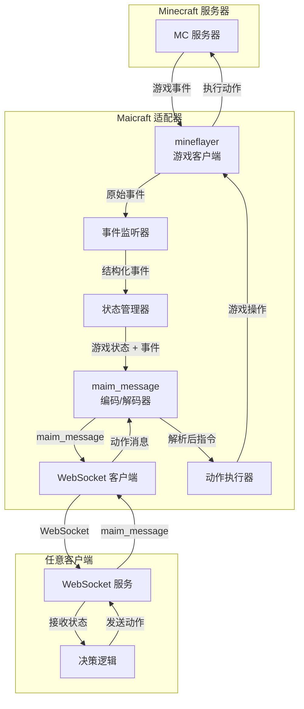

# Maicraft

> 📦 **Minecraft × MaiBot 适配器**
> 
> 将 *Minecraft* 游戏世界与 [MaiBot](https://github.com/MaiM-with-u/MaiBot) 智能体无缝连接，通过 WebSocket 双向同步游戏状态 & 高级动作指令。

***

## 🧐 项目简介

`Maicraft` 是一个**纯粹的双向适配器**，在 Minecraft 游戏与任何支持 `maim_message` 协议的客户端之间建立桥梁：

### 核心职责

1. **游戏事件 → maim_message**：

   - 监听 Minecraft 游戏事件（玩家加入、怪物出现、方块变化等）
   - 将当前游戏状态转换为`maim_message`的**提示词**
   - 将事件内容转换为 `maim_message` 的**消息体**
   - 通过 WebSocket 发送给对方

2. **maim_message → 游戏动作**：

   - 接收对方发送的 `maim_message` 格式动作指令
   - 解析消息内容为具体的游戏操作
   - 通过 [mineflayer](https://github.com/PrismarineJS/mineflayer) 控制游戏内机器人执行


### 设计理念

- **协议无关**：本项目不关心对方是 MaiBot、Amaidesu 还是其他客户端
- **纯粹适配**：只负责 Minecraft ↔ maim_message 的双向转换
- **统一接口**：所有客户端都通过相同的 `maim_message` 协议交互

> ⚠️ **注意**：本项目仅提供适配器功能，不包含 MaiBot 核心、Minecraft 服务器或决策逻辑。

***

## 🔧 架构概览



***

## ✨ 功能特性

- ✅ **统一协议**：完全基于 `maim_message` 协议，无需关心客户端类型
- ✅ **双向适配**：游戏事件 → 消息 | 消息 → 游戏动作
- ✅ **智能状态管理**：将游戏状态转换为自然语言提示词
- ✅ **事件驱动**：实时响应游戏内各种事件变化
- ✅ **动作执行**：将抽象指令转换为具体的游戏操作
- ✅ **类型安全**：TypeScript + maim_message 类型定义
- ✅ **模块化设计**：清晰的事件处理与动作执行分离

***

## 📋 依赖

| 组件         | 版本建议 | 说明                 |
| ------------ | -------- | -------------------- |
| Node.js      | >= 18    | 运行时               |
| TypeScript   | >= 5     | 开发依赖             |
| mineflayer   | latest   | Minecraft 机器人框架 |
| ws           | ^8       | WebSocket 客户端     |
| maim_message | latest   | 统一消息协议定义     |

***

## 🚀 快速开始

### 1. 安装依赖

```bash
pnpm install
```

### 2. 配置文件

复制示例配置文件并根据需要修改：

```bash
cp config.example.json config.json
```

### 3. 运行基础客户端示例

```bash
# 开发模式
pnpm run dev

# 或者构建后运行
pnpm run build
pnpm start
```

### 4. 使用示例

#### 基础客户端示例

```typescript
import { Router, MessageBuilder, RouteConfig } from 'maicraft';

// 配置连接到 MaiBot
const routeConfig: RouteConfig = {
  route_config: {
    'minecraft': {
      url: 'ws://127.0.0.1:8000/ws',
      token: undefined, // 如果需要认证
      reconnect_interval: 5000,
      max_reconnect_attempts: 10
    }
  }
};

const router = new Router(routeConfig);

// 注册消息处理器
router.registerMessageHandler(async (message) => {
  console.log('收到消息:', message);
  // 在这里处理来自 MaiBot 的消息
});

// 启动连接
await router.run();

// 发送消息到 MaiBot
const message = new MessageBuilder(
  'minecraft',
  'msg_' + Date.now(),
  'minecraft_bot',
  'minecraft_server'
)
.addText('Hello MaiBot!')
.build();

await router.sendMessage(message);
```

### 配置说明（config.json）

```jsonc
{
  "minecraft": {
    "host": "127.0.0.1",
    "port": 25565,
    "username": "MaiBot",
    "auth": "offline"
  },
  "websocket": {
    "url": "ws://127.0.0.1:3000/minecraft",
    "reconnectInterval": 5000,
    "heartbeatInterval": 30000
  },
  "adapter": {
    "stateUpdateInterval": 1000,
    "enabledEvents": ["chat", "playerJoin", "playerLeave", "mobSpawn", "blockBreak"],
    "maxMessageHistory": 100
  }
}
```

***

## 🗺️ 开发规划

| 阶段        | 目标               | 关键任务                                                                                            |
| ----------- | ------------------ | --------------------------------------------------------------------------------------------------- |
| **Phase 1** | 基础适配器框架     | • 建立 mineflayer 客户端连接 <br/> • 实现 WebSocket 通信 <br/> • 集成 maim_message 协议             |
| **Phase 2** | 事件监听与状态管理 | • 监听核心游戏事件 <br/> • 游戏状态 → 自然语言提示词 <br/> • 事件内容 → maim_message 格式           |
| **Phase 3** | 动作执行系统       | • maim_message → 游戏操作解析 <br/> • 基础动作：移动、聊天、交互 <br/> • 复杂动作：建造、战斗、收集 |
| **Phase 4** | 稳定性与性能       | • 错误处理与重连机制 <br/> • 状态同步优化 <br/> • 动作队列与优先级                                  |
| **Phase 5** | 扩展与优化         | • 更多游戏事件支持 <br/> • 动作执行反馈 <br/> • 配置热重载                                          |

### 详细实现计划

#### Phase 1: 基础适配器框架

```typescript
// 核心组件结构
interface MaicraftAdapter {
  // Minecraft 连接
  minecraftClient: MinecraftClient;
  // WebSocket 连接
  websocketClient: WebSocketClient;
  // 消息处理器
  messageHandler: MaimMessageHandler;
}
```

#### Phase 2: 事件监听与状态管理

```typescript
// 事件 → 消息转换示例
const gameEvent = {
  type: 'playerJoin',
  player: 'Steve',
  position: { x: 100, y: 64, z: 200 }
};

const maimMessage = {
  type: 'event',
  content: '玩家 Steve 加入了游戏',
  context: '当前位置：主城附近，在线玩家：3人，天气：晴朗',
  timestamp: Date.now()
};
```

#### Phase 3: 动作执行系统

```typescript
// 消息 → 动作转换示例
const maimMessage = {
  type: 'action',
  content: '去挖一些石头',
  metadata: { priority: 'normal' }
};

const gameActions = [
  { type: 'navigate', target: 'stone_area' },
  { type: 'mine', block: 'stone', count: 10 }
];
```

***

## 🤝 贡献指南

欢迎 PR 与 Issue！请确保：

1. 从 `dev` 分支创建您的功能分支；
2. `pnpm lint && pnpm test` 通过后再提交；
3. 在 PR 描述中清晰列出变更内容及动机。

***

## 📄 License

MIT © 2025-present Maicraft Contributors